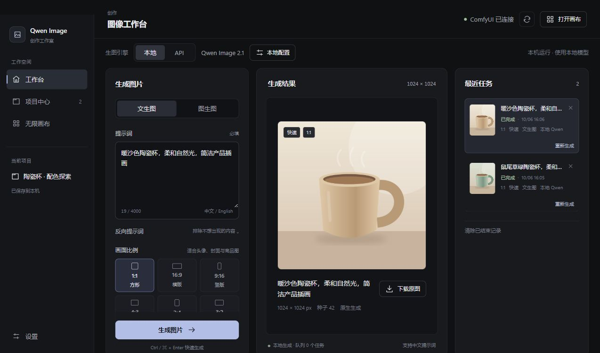
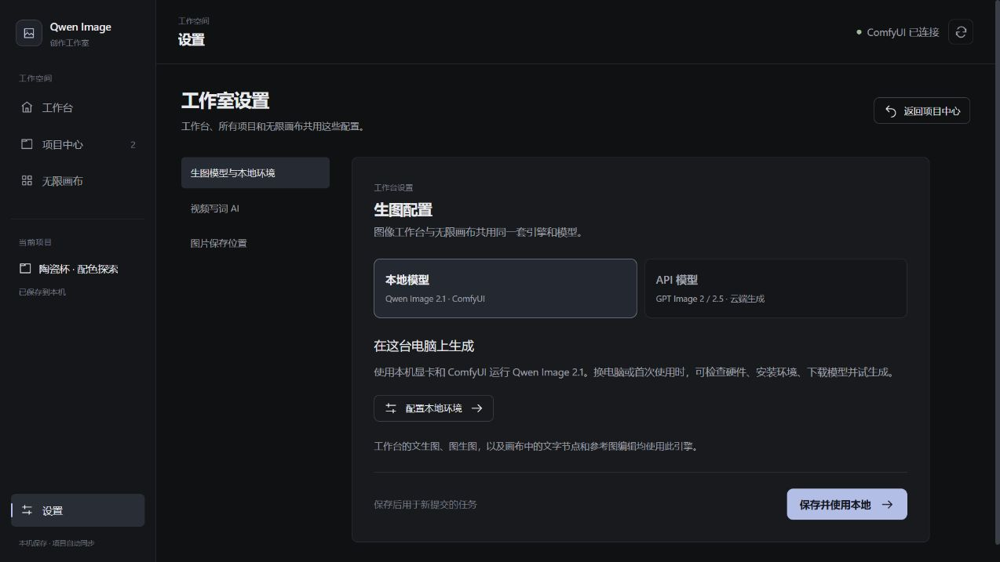
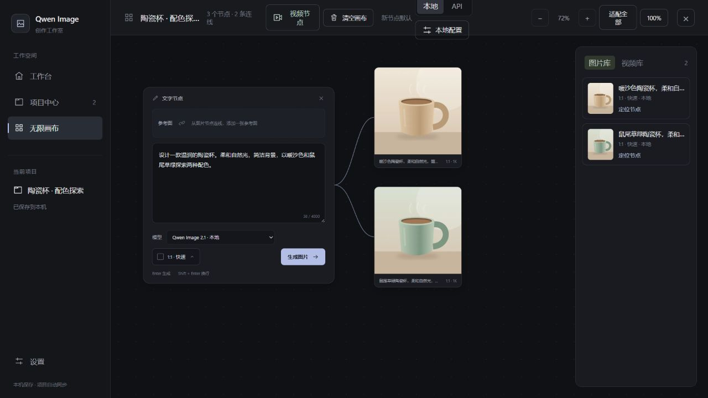
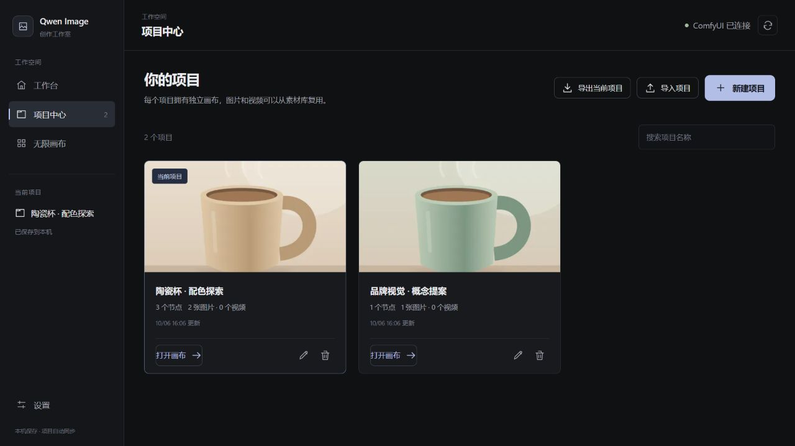

# Qwen Image 工作室

一个本机运行的图像创作工具：本地 Qwen Image、GPT Image 2 系列 API、项目管理、素材库和无限画布。



> 界面截图使用演示素材，展示工作流程。

## 快速启动

**Windows：** 下载源码后，双击根目录的 `start-workbench.bat`。首次启动会自动准备 Node.js、安装依赖并打开网页。

**手动启动：** 安装 Node.js **24.14 或更新版本**，然后运行：

```powershell
git clone https://github.com/xuhang0310/qwen-image-gallery.git
cd qwen-image-gallery
npm ci
npm start
```

打开 [http://127.0.0.1:3788](http://127.0.0.1:3788)，进入左侧 **设置** 完成模型配置。

## 配置模型

工作台与所有项目共用设置，也可以在画布节点中单独选择模型。

| 方式     | 配置步骤                                                                                            |
| -------- | --------------------------------------------------------------------------------------------------- |
| API 生图 | 设置 → 生图模型与本地环境 → API 模型，填写接口地址和密钥，选择模型并保存                            |
| 本地生图 | 设置 → 生图模型与本地环境 → 本地模型 → 配置本地环境，按提示检查硬件、安装 ComfyUI、下载模型并试生成 |

- **API：** 支持 GPT Image 2、GPT Image 2.5 Flare / Sunburst，需要接口服务支持对应模型；无需本地显卡或 ComfyUI。
- **本地：** 使用 Qwen Image 2.1。自动安装面向 Windows x64 + NVIDIA RTX，能否运行以界面检查和试生成结果为准。
- **视频：** 使用本地 MiniMax H3，需要另行配置视频模型和 ComfyUI 节点；生图安装流程不包含视频环境。



## 工作台与无限画布

- **工作台：** 输入提示词或上传参考图，选择比例与质量，生成、查看历史或下载原图。
- **无限画布：** 创建文字、图片和视频节点，通过连线传递参考图；每个文字节点可选择本地或 API 模型。
- **素材库：** 图片和视频可按需加入画布，加入后自动定位；进入画布不会自动添加全部素材。
- **全部素材：** 左侧素材库汇总所有项目生成的图片和视频，支持搜索、类型与来源筛选、预览和下载，清除历史不影响素材保留。
- **多任务：** API 最多同时执行 3 个请求，本地 ComfyUI 按队列执行。

文字节点中按 `Enter` 生成，`Shift + Enter` 换行；工作台用 `Ctrl / ⌘ + Enter` 快速生成。



## 项目中心

新建、搜索、重命名、导入或导出项目。每个项目有独立画布，图片与视频素材跨项目复用。

项目自动保存到本机；刷新浏览器会恢复所在页面、当前项目和画布视角。删除项目会保留素材文件。



## 保存与迁移

- **图片目录：** 在 设置 → 图片保存位置 修改，默认 `.data/generated-images`，修改后对新生成的图片生效。
- **项目与记录：** 默认保存在 `.data`；视频保存在 ComfyUI 输出目录。
- **换电脑：** 复制 `.data`、自定义图片目录及 ComfyUI 视频素材，再在新电脑配置本地环境或 API。

项目导出的 JSON 只保存结构与素材引用，不包含图片或视频文件。`.data` 含本机配置和凭据，请自行备份并妥善保管。

## 开发

技术栈：Vue 3 + Vite + Node.js + SQLite + ComfyUI。

```powershell
node server.js  # 启动后端
npm run dev     # 另开终端，启动前端开发
npm run check   # 代码检查与构建
```
